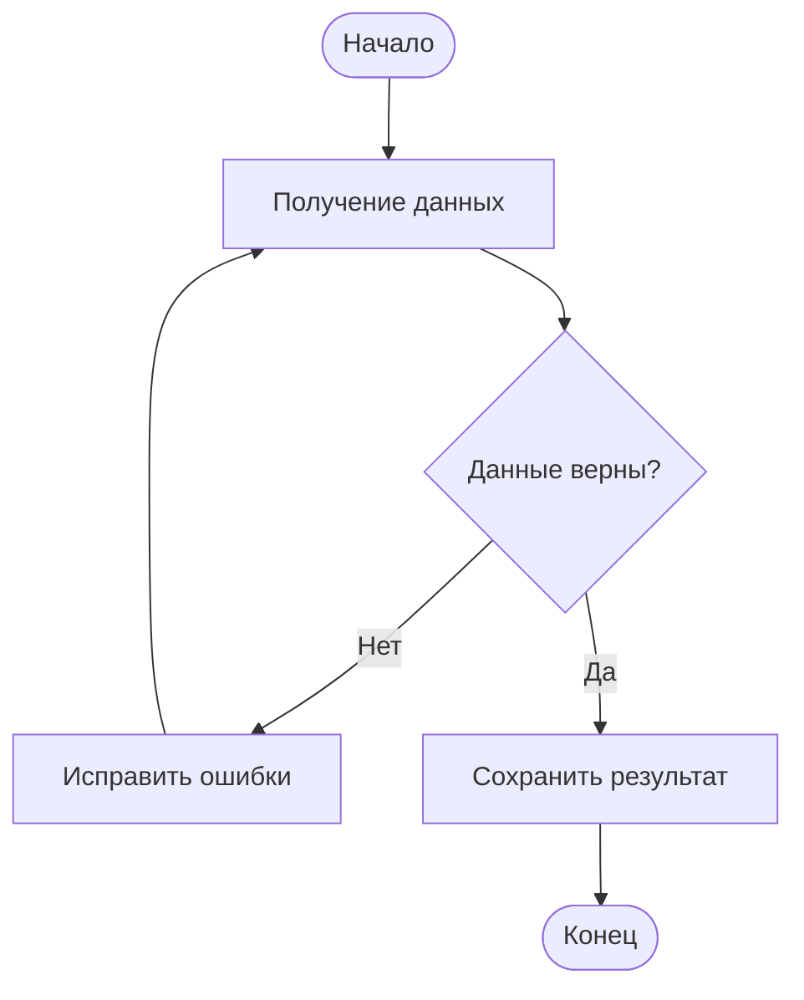

### Моя схема алгоритма

```mermaid
flowchart TD
    A([Начало]) --> B[Получение данных]
    B --> C{Данные верны?}
    C -- Нет --> D[Исправить ошибки]
    D --> B
    C -- Да --> E[Сохранить результат]
    E --> F([Конец])
```
